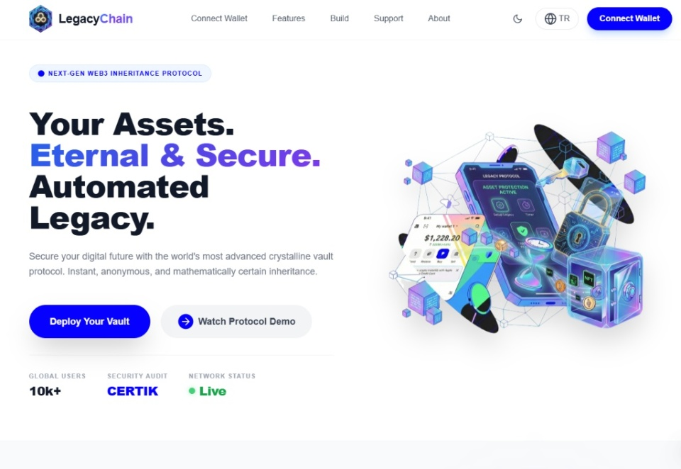
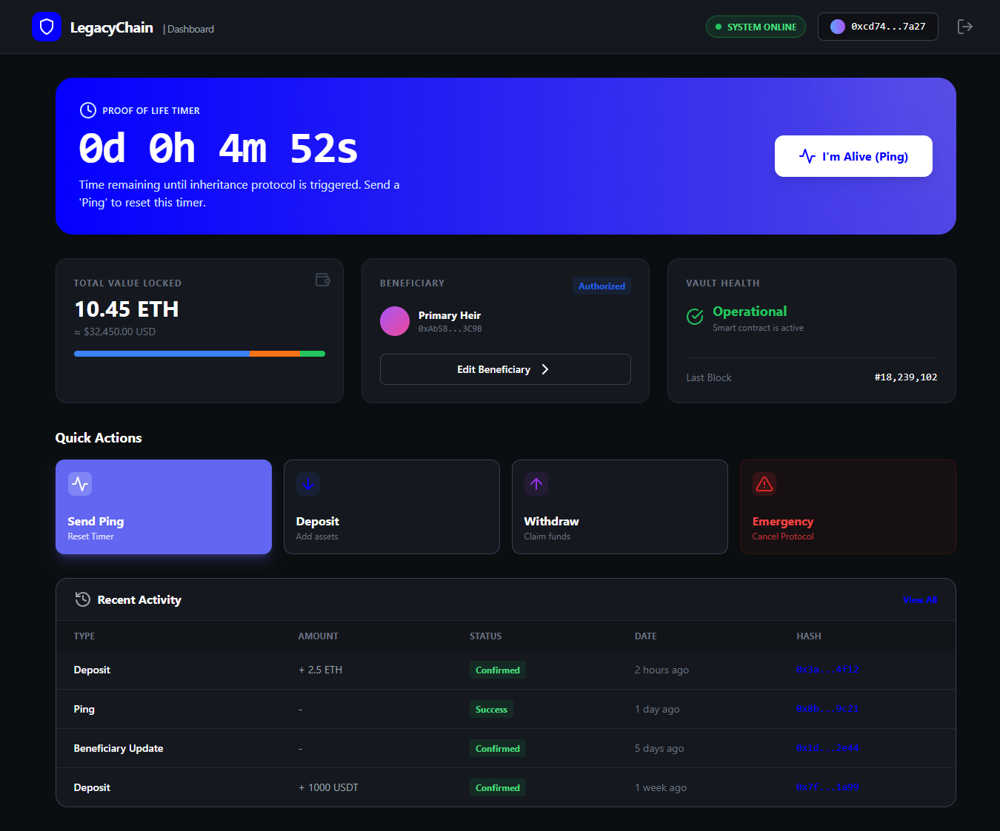
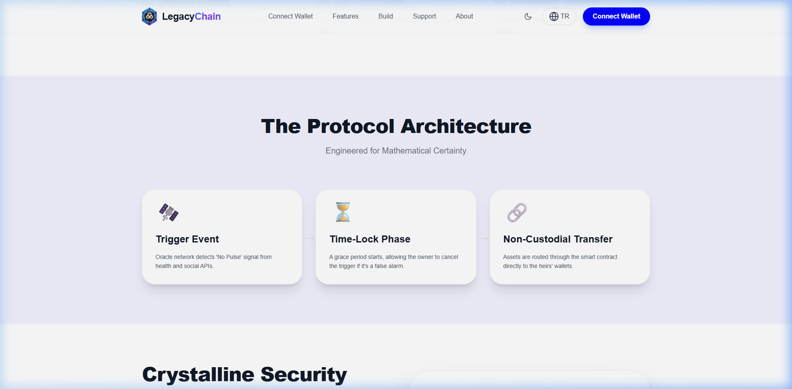

# LegacyChain

A decentralized digital inheritance protocol on Ethereum. LegacyChain allows users to securely lock crypto assets in a smart contract vault, assign multiple heirs with percentage-based shares, and automate the inheritance distribution through a combination of inactivity detection and decentralized oracle consensus.

## Screenshots







## Overview

Traditional inheritance systems rely on centralized intermediaries — banks, lawyers, courts. LegacyChain replaces all of that with trustless, on-chain logic:

- **Vault deployment** — Each user deploys their own vault via `VaultFactory` (minimal proxy pattern). The owner deposits ETH into the vault and defines a list of beneficiaries with percentage-based allocation
- **Proof-of-Life mechanism** — The owner periodically confirms activity via `ping()`. An autonomous activity tracker (Ghost Ping) also monitors on-chain interactions automatically without manual pings
- **Oracle consensus** — A decentralized `OracleRegistry` contract collects signed attestations from multiple independent authorities (hospital, government, legal). Consensus requires signals from at least 2 different category sources before a death is confirmed
- **Grace period** — Before any transfer executes, a 24-hour grace period gives the owner a final window to cancel if the trigger was a false alarm
- **Automated distribution** — Once confirmed, the vault distributes funds to all active heirs based on their assigned percentages using a pull-over-push pattern — no manual intervention needed
- **Commit-Reveal privacy** — Heir identities can be kept secret on-chain until after the owner's death is confirmed, then revealed with a cryptographic proof

## Architecture

```
┌─────────────┐     ┌──────────────────┐     ┌──────────────────────┐
│   Owner      │────▶│  VaultFactory     │────▶│  InheritanceVault    │
│  (User)      │     │  (Clones.sol)     │     │  (per-user vault)    │
└─────────────┘     └──────────────────┘     └──────────────────────┘
                                                        │
                              ┌─────────────────────────┤
                              │                         │
                    ┌──────────────────┐      ┌──────────────────────┐
                    │  OracleRegistry  │      │  Oracle Backend      │
                    │  (EIP-712 sigs)  │      │  (Node.js REST API)  │
                    └──────────────────┘      └──────────────────────┘
                              │                         │
               ┌──────────────┼──────────────┐          │ Authorities:
               ▼              ▼              ▼           │ - Hospital
         ┌──────────┐  ┌──────────┐  ┌──────────┐       │ - Government
         │  Heir 1  │  │  Heir 2  │  │  Heir N  │       │ - Legal
         │  (40%)   │  │  (35%)   │  │  (25%)   │       │
         └──────────┘  └──────────┘  └──────────┘       │
```

## Core Features

### Security Layer
- **ReentrancyGuard** — Prevents recursive call exploits on all fund-transfer functions
- **TimeLock mechanism** — Any heir modification requires a waiting period before execution, protecting against coercion or unauthorized changes
- **Multi-sig emergency protocol** — Critical operations require 2-of-3 multi-signature approval from trusted signers (owner, oracle, primary heir)
- **Pull-over-Push pattern** — ETH and token distributions are queued in `pendingWithdrawals`; each heir withdraws their own share independently, preventing DoS attacks
- **Emergency Pause** — The contract can be paused by the owner in critical situations
- **Access control** — Role-based permissions for owner, oracle, and heirs with strict modifier checks

### Inheritance Engine
- **Multi-heir support** — Up to 10 beneficiaries with named entries and percentage-based allocation
- **Commit-Reveal (Privacy Mode)** — Heir identities can be stored as a `keccak256` hash on-chain and revealed only after death is confirmed, protecting heir privacy
- **Decentralized Oracle (OracleRegistry)** — EIP-712 signed attestations from multiple authority categories. Consensus requires at least 2 distinct category signals (e.g. government + health, or government + legal)
- **Grace Period system** — 24-hour safety window between trigger detection and fund distribution. The owner can still cancel via `recordActivity()`
- **Ghost Ping (Autonomous Activity Tracking)** — Automatically records owner's on-chain activity without requiring manual pings
- **NFT inheritance (ERC-721)** — Specific NFTs can be assigned to individual heirs via `assignSpecificNFT()`
- **ERC-20 Token inheritance** — Token balances held in the vault or approved from the owner's wallet are distributed proportionally
- **Dispute mechanism** — Any authorized party can open a dispute to pause the inheritance process for review

### Vault Factory
- **`VaultFactory.sol`** — Deploys individual `InheritanceVault` clones for each user using OpenZeppelin's `Clones.sol` (EIP-1167 minimal proxy). This avoids redeploying the full contract bytecode each time, saving gas significantly
- **Auto-registration** — Each new vault is automatically registered in the `OracleRegistry`, granting it permission to interact with oracle signal resets

### Oracle Backend (Node.js)
- **REST API** — A Node.js/Express server that bridges off-chain authority data with on-chain oracle contracts
- **Authority roles** — Supports hospital, government, legal, and family authority signers configured via environment variables
- **EIP-712 relay** — The backend builds and relays EIP-712 typed-data signatures on behalf of authorities, so authority private keys never need to be exposed on-chain directly
- **Case management** — Full lifecycle tracking: `WATCH → CASE_OPEN → ATTESTED → GRACE_ACTIVE → CLAIMABLE → RESOLVED`
- **Email notifications** — Sends alerts to registered subscribers (heirs, family) at key lifecycle events via SMTP / Nodemailer
- **Rate limiting & API key auth** — Protects oracle endpoints from abuse

### Smart Contracts

| Contract | Description |
|----------|-------------|
| `InheritanceVault.sol` | Per-user vault — multi-heir management, timelock, oracle integration, reentrancy protection, grace period, NFT/ERC-20 support, commit-reveal, pull-over-push |
| `MultiHeirInheritance.sol` | Standalone advanced vault — same features as InheritanceVault, used directly without factory |
| `OracleRegistry.sol` | Advanced oracle — EIP-712 signed attestations, case lifecycle management, category-based consensus, dispute handling |
| `DecentralizedOracle.sol` | Lightweight oracle — simple 2-of-N signal consensus without EIP-712 |
| `VaultFactory.sol` | Factory — deploys InheritanceVault clones per user, auto-registers vaults in OracleRegistry |
| `MockERC20.sol` | Test ERC-20 token for inheritance scenarios |
| `MockERC721.sol` | Test NFT token for NFT inheritance scenarios |

## Tech Stack

| Component | Technology |
|-----------|------------|
| Blockchain | Ethereum (Sepolia Testnet) |
| Smart Contracts | Solidity ^0.8.20 |
| Frontend | React (via CDN) + Tailwind CSS + Ethers.js v5.7 |
| Oracle Backend | Node.js + Express + Ethers.js v6 |
| Testing | Hardhat + Chai |
| Security | ReentrancyGuard, TimeLock, Multi-sig, Pull-over-Push, EIP-712 |
| Proxy Pattern | OpenZeppelin Clones (EIP-1167) |

## Getting Started

```bash
git clone https://github.com/berzanunsal1621-max/LegacyChain.git
cd LegacyChain
npm install
```

### Run Frontend (local demo)

```bash
npm run frontend
# open http://127.0.0.1:8080
```

### Run Oracle Backend

```bash
cp oracle-backend/.env.example oracle-backend/.env
# Fill in your private keys, contract addresses, and SMTP config
npm run backend
```

### Deploy Contracts (full stack)

```bash
# Start a local Hardhat node
npx hardhat node

# Deploy OracleRegistry + VaultFactory + sample vault + MockERC20
npm run deploy:full
```

After deployment, copy the printed contract addresses into `oracle-backend/.env` and update `index.html` with the factory address. You can also deploy directly via Remix IDE → Injected Provider (MetaMask) → Sepolia network.

## Inheritance Flow

```
1. Owner creates vault via VaultFactory → deposits ETH
2. Owner adds heirs (plain or commit-reveal hash)
3. Owner pings periodically to reset the inactivity timer
4. If inactivity detected OR oracle authorities submit death signals:
   a. OracleRegistry reaches consensus (≥2 category signals)
   b. Anyone calls startGracePeriod() on the vault
   c. 24-hour grace period begins — owner can still cancel
5. After grace period:
   a. claimInheritance() is called → shares queued in pendingWithdrawals
   b. Each heir calls withdrawShare() to pull their ETH
   c. For tokens: claimTokens() → withdrawTokenShare()
   d. For NFTs: claimSpecificAsset()
```

## Oracle Consensus Model

The `OracleRegistry` requires attestations from **at least 2 distinct authority categories** before confirming death:

| Category | Example Source |
|----------|---------------|
| `government` | Civil registry, death certificate |
| `health` / `medical` | Hospital records, wearable IoT |
| `legal` | Legal representative attestation |

The backend signs attestations using **EIP-712 typed data** and relays them on-chain. Each authority can only submit one signal per case.

## Testing

```bash
npx hardhat test                                      # all tests
npx hardhat test test/security-test.js               # access control, reentrancy
npx hardhat test test/multi-heir-test.js             # heir management, timelock, distribution
npx hardhat test test/commit-reveal-test.js          # privacy / commit-reveal
npx hardhat test test/multisig-emergency-test.js     # multi-sig emergency
npx hardhat test test/oracle-extended-test.js        # oracle signal handling
npx hardhat test test/v2-factory-oracle-test.js      # factory + OracleRegistry integration
npx hardhat test test/specific-assets-test.js        # NFT and ERC-20 specific wills
npx hardhat test test/advanced-protocol-test.js      # grace period, pull-over-push
npx hardhat test test/backend-notifications-test.js  # backend notification logic
npx hardhat test test/risk-engine-test.js            # risk engine scoring
```

Test coverage includes: access control, multi-heir CRUD, timelock enforcement, inheritance claim flow, reentrancy attack simulation, commit-reveal privacy, NFT/ERC-20 inheritance, oracle signal handling, factory deployment, grace period logic, dispute flow, and gas optimization benchmarks.

## Documentation

- [Whitepaper](WHITEPAPER.md) — Full protocol specification, threat model, and design rationale

## Environment Variables

See [`oracle-backend/.env.example`](oracle-backend/.env.example) for the full list. Key variables:

| Variable | Description |
|----------|-------------|
| `ORACLE_ADDRESS` | Deployed OracleRegistry contract address |
| `INHERITANCE_ADDRESS` | Deployed vault address to monitor |
| `RPC_URL` | Ethereum RPC endpoint |
| `API_KEY` | Secret key for protected backend endpoints |
| `AUTHORITY_HOSPITAL_PRIVATE_KEY` | Hospital authority signer private key |
| `AUTHORITY_GOVERNMENT_PRIVATE_KEY` | Government authority signer private key |
| `AUTHORITY_LEGAL_PRIVATE_KEY` | Legal authority signer private key |
| `SMTP_HOST` / `SMTP_USER` / `SMTP_PASS` | Email notification config |

## Author

Berzan Unsal — Computer Engineering, Mugla Sitki Kocman University
